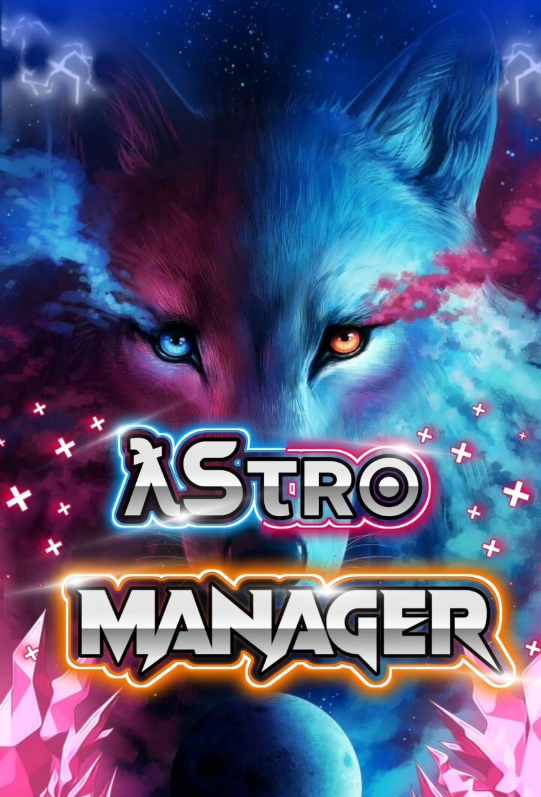

# Hᴇʟʟᴏ ✨
### 𝙏𝙃𝙄𝙎 𝙄𝙎 •𝘼𝙎𝙏𝙍𝙊 𝙈𝘼𝙉𝘼𝙂𝙀𝙍•
<p align="center"><h1 align="center"><b> ƛsτʀ๏ Manager🇮🇳</b></h1></p>
<p align="center">
   <a href="https://t.me/AstroManager_RoBoT">
      
      </a>
      <br>
   <b>ƛsτʀ๏ Manager</b><br>
   <i>ƬӇЄ ƑƲƬƲƦƖṠƬƖƇ Manager</i>
</p>
<h1 style="color: red"> 𝚃𝙷𝙴 𝙵𝚄𝚃𝚄𝚁𝙰𝚂𝚃𝙸𝙲 𝙶𝚁𝙾𝚄𝙿 𝙼𝙰𝙽𝙰𝙶𝙴𝚁 𝙱𝙾𝚃</h1>


## <h1 align="left">Sᴛᴀᴛᴜs 𝙾𝙵 𝙱𝙾𝚃 </h1> 

[](https://github.com/AstroUB/Astro-UB)
[]( https://github.com/AstroUB/Astro-UB#copyright--license)
[](https://www.python.org/downloads/release/python-360/)
 <br> 
 
<p align="left">
    <a href="https://github.com/PsychoBots/Astro-Manager/network"></a>
    <a href="https://github.com/PsychoBots/Astro-Manager/stargazers"></a>
</p>

#### 𝙈𝘼𝙄𝙉𝙏𝘼𝙉𝘼𝙉𝘾𝙀
<p align="left">
    <a href="https://github.com/PsychoBots/Astro-Manager"> </a>
    <a href="https://github.com/PsychoBots/Astro-Manager/commits/prince"> </a>
    <a href="https://github.com/PsychoBots/Astro-Manager/issues"> </a>
    <a href="https://github.com/PsychoBots/Astro-Manager/network/members"> </a>
    <a href="https://pypi.org/project/Telethon/"> </a>
</p>

#### 𝑷𝑼𝑳𝑳 𝑹𝑬𝑸𝑼𝑬𝑺𝑻𝑺
[]( https://GitHub.com/Psychobots/Astro-Manager/pulls)
[](https://GitHub.com/Psychobots/Astro-Manager/pulls?q=is:closed) 

# <i><b> sᴜᴘᴘ๏ʀᴛ </b></i>

<a href="https://telegram.me/PsychoBots" target="_blank"></a>

<a href="https://telegram.me/PsychoBots_Chat" target="_blank"></a>

# 𝗗𝗘𝗣𝗟𝗢𝗬𝗠𝗘𝗡𝗧
<a href="https://heroku.com/deploy?template=https://github.com/PsychoBots/Astro-Manager" target="_blank"></a>
    
    

 <details><summary> <h2>• 𝙻𝙸𝙲𝙴𝙽𝚂𝙴 •</h2> </summary>


Copyright (C) 2021 Astro-UB

Poject [Astro-UB](https://github.com/Astro-Manager) is free software: you can redistribute it and/or modify
it under the terms of the GNU General Public License as published by
the Free Software Foundation, either version 3 of the License, or
(at your option) any later version.

This program is distributed in the hope that it will be useful,
but WITHOUT ANY WARRANTY; without even the implied warranty of
MERCHANTABILITY or FITNESS FOR A PARTICULAR PURPOSE.  See the
GNU General Public License for more details.

You should have received a copy of the GNU General Public License
along with this program. If not, see <https://www.gnu.org/licenses/>.

Released under [GNU](/LICENSE) by [LoverBoy](https://github.com/LoverboyXD) .

</details>

<h3> Credits  </h3>

```sh
•1. MashaRoBot
•2. PsychoBots
•3. Alone_loverboy
•4. Mr-Dark-Prince
```

# To Check Codes Click Below Button <br>
<a href="https://github.com/PsychoBots/Astro-Manager" target="_blank"></a>

<a

## ~*Thanks For Using Astro-Manager❤️* 

### 𝙅𝙊𝙄𝙉 𝘾𝙃𝘼𝙉𝙉𝙀𝙇 𝙏𝙊 𝘽𝙀 𝙐𝙋𝘿𝘼𝙏𝙀𝘿 😄✓ <br> 𝘼𝙉𝘿 <br> 𝙃𝙀𝙇𝙋𝘾𝙃𝘼𝙏 𝙁𝙊𝙍 𝙃𝙀𝙇𝙋✓

<hr>

𝙁𝙊𝙇𝙇𝙊𝙒 𝙈𝙀 𝙊𝙉 [𝙂𝙄𝙏𝙃𝙐𝘽](https://github.com/loverboyXD)

<hr>
